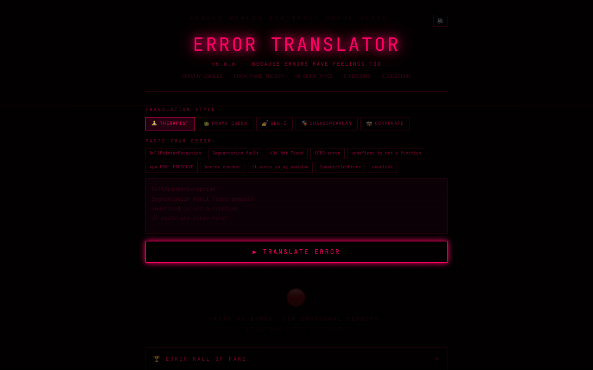

# :rotating_light: Error Translator

**Translates cryptic error messages into emotional human language.**

Built by [Arnold Wender](https://arnoldwender.com)

[](https://error-translator.netlify.app)

---



## What is this?

We've all stared at `Segmentation fault (core dumped)` and felt nothing but confusion and existential dread. Error Translator takes those cryptic error messages and translates them into something a human can actually feel — through 5 wildly different personas. From a gentle therapist to a Shakespearean dramatist, finally understand your errors on an emotional level.

> **Therapist:** "It sounds like your program is going through a lot right now. The null pointer? That's just its way of saying it needs space."

## Features

- **5 Translator Personas** — Therapist, Drama Queen, Gen-Z, Shakespearean, Corporate
- **Emotion Meter** — Visualize the emotional intensity of each translation
- **Error Hall of Fame** — The greatest error translations of all time
- **48 Errors Across 6 Languages** — JavaScript, Python, Java, C++, Rust, Go
- **Animated Translations** — Smooth persona-switching with Framer Motion
- **Shareable Results** — Generate and share your favorite translations
- **Sentry-Style Error Dashboard** — A fake Sentry dashboard tracking your emotional error rate
- **Jira Ticket Generator** — Auto-generate absurd Jira tickets from translated errors
- **Emotional State Timeline** — Grafana-style chart tracking your emotional journey through debugging
- **CLI Mode** — A terminal-based interface for translating errors like a real developer
- **Fake Changelog** — Version history of the translator's emotional growth
- **Pro Tier** — Premium upgrade for even more dramatic translations

## Tech Stack

| Technology | Purpose |
|---|---|
| React 18 | UI framework |
| TypeScript | Type safety |
| Vite | Build tool & dev server |
| Tailwind CSS | Styling |
| Framer Motion | Animations |
| canvas-confetti | Celebration effects |
| html2canvas | Share card generation |
| Web Audio API | Sound effects |
| Lucide React | Icons |

## Getting Started

```bash
# Clone the repo
git clone https://github.com/arnoldwender/error-translator.git
cd error-translator

# Install dependencies
npm install

# Start dev server
npm run dev

# Build for production
npm run build
```

## Live Demo

**[https://error-translator.netlify.app](https://error-translator.netlify.app)**

## Contributing

Know an error message that needs emotional translation? Check out [CONTRIBUTING.md](./CONTRIBUTING.md) for guidelines on how to get involved.

## License

This project is licensed under the MIT License — see the [LICENSE](./LICENSE) file for details.
